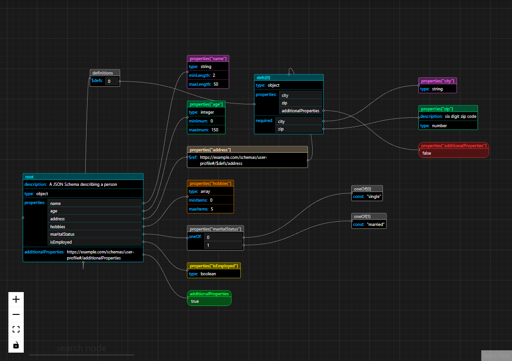

<p align="center">
  
</p>

# JSON Schema Visualizer

A visual, interactive, graph-based tool to explore, debug, and understand complex JSON Schemas.

JSON Schema Visualizer is a browser-based tool that converts JSON Schema into an interactive node graph. It helps developers understand deeply nested schemas, `$ref` chains, reusable `$defs`, and circular references
without manually tracing large JSON Schema files.

---

## Table of Contents

- [Why JSON Schema Visualizer?](#why-json-schema-visualizer)
- [Features](#features)
- [Demo](#demo)
  - [Example JSON Schema](#example-json-schema)
- [Understanding the Visualization](#understanding-the-visualization)
  - [Node colors & schema types](#node-colors--schema-types)
  - [Keywords & edges](#keywords--edges)
  - [$defs (reusable schemas)](#defs-reusable-schemas)
  - [Boolean schemas](#boolean-schemas)
  - [Controls](#controls)
- [How It Works](#how-it-works)
- [Current Limitations / Known Issues](#current-limitations--known-issues)
- [Run locally](#run-locally)
  - [Using Docker (recommended)](#using-docker-recommended)
  - [Running directly (without Docker)](#running-directly-without-docker)
- [Tech Stack](#tech-stack)
- [Future Enhancements / Roadmap](#future-enhancements--roadmap)
- [Contributing](#contributing)
  - [Getting started](#getting-started)
- [Additional Notes](#additional-notes)

---

## Why JSON Schema Visualizer?

JSON Schemas become difficult to reason about as they grow:

- Deeply nested objects
- Heavy usage of [`$ref`](https://www.learnjsonschema.com/2020-12/core/ref)
- Circular references
- Unclear relationships between subschemas

**JSON Schema Visualizer** converts schemas into an interactive graph so you can **see structure, references, and relationships** instantly, instead of mentally parsing large JSON Schema files.

---

## Features

- Interactive graph-based visualization of JSON Schema
- `$ref` resolution (local & external)
- Circular reference handling
- Clear node & edge representation for schema entities
- Light & dark theme support
- Runs fully in your browser -- all data stays on your device

---

## Demo

### Example JSON Schema

```json
{
  "$schema": "https://json-schema.org/draft/2020-12/schema",
  "$id": "https://example.com/schemas/user-profile",
  "description": "A JSON Schema describing a person",
  "type": "object",
  "properties": {
    "name": {
      "type": "string",
      "minLength": 2,
      "maxLength": 50
    },
    "age": {
      "type": "integer",
      "minimum": 0,
      "maximum": 150
    },
    "address": {
      "$ref": "#/$defs/address"
    },
    "hobbies": {
      "type": "array",
      "minItems": 0,
      "maxItems": 5
    },
    "maritalStatus": {
      "oneOf": [{ "const": "single" }, { "const": "married" }]
    },
    "isEmployed": {
      "type": "boolean"
    }
  },
  "additionalProperties": true,
  "$defs": {
    "address": {
      "type": "object",
      "properties": {
        "city": {
          "type": "string"
        },
        "zip": {
          "description": "six digit zip code",
          "type": "number"
        },
        "additionalProperties": false
      },
      "required": ["city", "zip"]
    }
  }
}
```


_This diagram shows the structure of the "Example JSON Schema" above._

---

## Understanding the Visualization

> [!NOTE]
> The visualization is presented as a graph where **nodes** represent JSON Schemas or subschemas, and **edges** represent the relationships between them.

### Node colors & schema types

- Each schema/subschema that is rendered as a node is assigned a distinct color based on its `type`.
- If a schema/subschema explicitly defines a `type`, the node's color directly reflects that type.
- For schemas/subschemas without an explicit `type` keyword, the tool infers the type from related keywords. The node color is then assigned based on this inference.
  - In most cases, inference is correct.
  - If multiple instance types are defined (e.g., `type: ["string", "number"]`), there is currently no dedicated color. In such cases, the node color is determined based on **type inference**, following this priority order: `object > array > string > number`.
  - If inference fails entirely, a **soft gray** color is applied to the corresponding node as a fallback.
- Refer to the table below for node color references:

    <table>
    <tr>
        <td>string</td>
        <td>numeric</td>
        <td>array</td>
        <td>object</td>
        <td>null</td>
        <td>reference</td>
        <td>others</td>
        <td>booleanSchema</td>
    </tr>
    <tr>
        <td style="background-color:#FF6EFF; color:#000; text-align:center;">neon magenta</td>
        <td style="background-color:#00FF95; color:#000; text-align:center;">neon mint</td>
        <td style="background-color:#FF8F00; color:#000; text-align:center;">neon amber</td>
        <td style="background-color:#00E5FF; color:#000; text-align:center;">neon cyan</td>
        <td style="background-color:#A259FF; color:#fff; text-align:center;">neon purple</td>
        <td style="background-color:#FFE1BD; color:#000; text-align:center;">neon apricot</td>
        <td style="background-color:#CCCCCC; color:#000; text-align:center;">neon gray</td>
            <td>
        <table style="width:100%; border-collapse: collapse;">
            <tr>
            <td style="background-color:#12FF4B; color:#000; text-align:center;">true</td>
            <td style="background-color:#FF3B3B; color:#fff; text-align:center;">false</td>
            </tr>
        </table>
        </td>
    </tr>
    </table>

### Keywords & edges

- Keywords displayed inside a node represent how that schema defines the instance.
- If a keyword's value is itself a subschema, a new node is created.
- The child node is connected to the parent by an edge:
  - Edges originate from the left side of the parent node, aligned vertically near the keyword they represent.
  - ⚠️ There is a known issue with precise source-handle positioning (see _Known Issues_).

### $defs (reusable schemas)

- If a schema contains `$defs`, a special "definitions" container node is created.
- This node:
  - Does not represent a schema itself
  - Groups all reusable subschemas
  - Connects to the parent schema from the bottom
- This design intentionally separates regular subschemas from **reusable definitions**.

### Boolean schemas

- Boolean schemas are visually distinct:
  - `true` --> green node
  - `false` --> red node
- Unlike _object schema_ nodes, _boolean schema_ colors are applied to the **entire node**, not just the title.
- Boolean nodes have more rounded borders to clearly differentiate them.

Design improvements are welcome :)

### Controls

- Zoom, fit-view, and other graph controls are available in the bottom-left corner of the visualization.

---

## How It Works

- The input JSON Schema is parsed into an **AST** (Abstract Syntax Tree) using [Hyperjump JSON Schema](https://github.com/hyperjump-io/json-schema). This AST represents the full structure of the schema.  
  _All `$ref` references, both local and external, are automatically resolved by Hyperjump, so the AST includes fully expanded schemas as part of its structure_
- The resolved AST is transformed into graph **nodes** and **edges**, where each node represents a schema or subschema, and edges represent relationships between parent and child nodes.
- These nodes and edges are rendered as an interactive graph using [React Flow](https://reactflow.dev), allowing users to explore and understand the schema visually.

---

## Current Limitations / Known Issues

- The **search** feature is visible in the UI but not yet implemented.
- When editing a schema in real time, the node handles may appear misaligned.  
  **Workaround**: Refresh the page after editing to restore correct handle positions.
- If a `$defs` subschema references another `$defs` subschema defined later in the schema, the source/target handles will swap, and the title of the referencing node will be clipped.

These issues will be addressed as time permits. If you encounter any other problems or have suggestions, please consider opening an issue to start a discussion.

---

## Run locally

You can run the application locally either directly or using Docker (recommended for consistent environment).

### Using Docker (recommended)

- Build the Docker image using the `Dockerfile` at the root of the repository:
  ```bash
  docker build --no-cache -t visualize-json-schema -f ./Dockerfile .
  ```
- Run the Docker container:
  ```bash
  docker run -p 8080:80 visualize-json-schema
  ```
- To run the container in detached mode, use:
  ```
  docker run -d -p 8080:80 visualize-json-schema
  ```
- Access the application in your browser at http://localhost:8080.

### Running directly (without Docker)

- Install dependencies:
  ```bash
  npm install
  ```
- Start the development server:
  ```
  npm run dev
  ```
- Open your browser at the URL shown in the terminal (http://localhost:5173).

> [!WARNING]
> Running directly is fine for development, but using Docker ensures a consistent environment across machines.

---

## Tech Stack

- React + Vite
- [Hyperjump JSON Schema](https://github.com/hyperjump-io/json-schema) -- validation & AST generation
- [React Flow](https://reactflow.dev/) -- graph visualization
- [Monaco Editor](https://microsoft.github.io/monaco-editor/) -- in-browser schema editor
- UI inspiration from [JSONCrack](https://github.com/AykutSarac/jsoncrack.com)

---

## Future Enhancements / Roadmap

To make this tool more accessible, intuitive, and developer-friendly, we are planning several future enhancements aimed at helping users understand and build complex JSON Schemas effortlessly.

- [ ] Export the visualization as an image
- [ ] Upload JSON Schema files directly for visualization
- [ ] VS Code extension for in-editor JSON Schema visualization
- [ ] Inline graph editing with bidirectional updates between the graph and the schema
- [ ] No-code JSON Schema generator (longer-term goal)

We'd love to hear from you! If you have ideas, suggestions, or feedback, feel free to open an issue and help shape the future of this project.

---

## Contributing

Contributions are welcome and appreciated

Ways to contribute:

- Report bugs or request features via Issues
- Improve documentation
- Fix bugs or implement new features
- Suggest better visual or UX improvement

### Getting started

- Fork the repository
- Create a new branch  
  `git checkout -b feature/my-feature`
- Make your changes
- Commit with a clear message
- Open a Pull Request

---

## Additional Notes

> [!TIP]
> The application supports both **light** and **dark** themes. For the best visual experience -- we recommend using the **dark theme**.

> [!IMPORTANT]
> All data processing occurs **locally on your device.** No data is sent to or processed on external servers.
